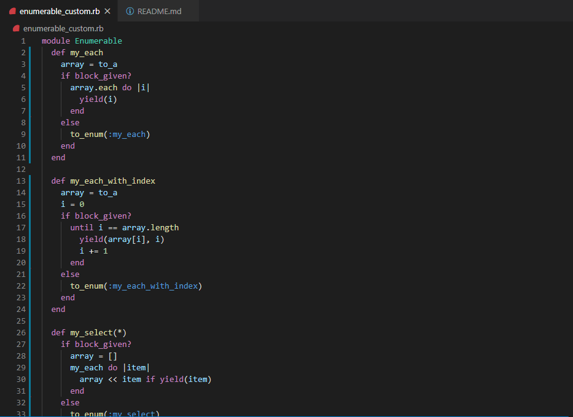
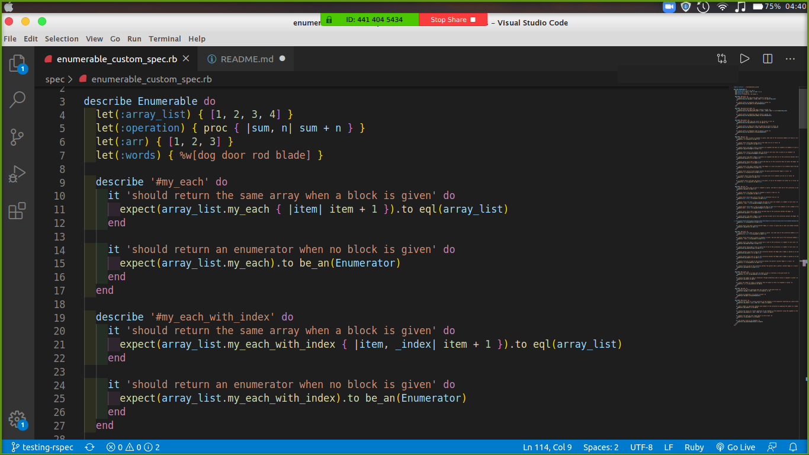

# Projrct Enumerables

>In this project we were tasked to rebuild the enumerable methods of the ruby enumerable module that provide iterator functionality on Array and Hash classes among others.

>We also created a test file using R-SPEC to make sure that all the methods are functioning properly.

## Built With

Ruby
vscode
Rspec
Rubocop

## Live Demo

[Live Demo Link](https://repl.it/@frankoo/enumerables)

## Getting Started

To get a local copy up and running follow these simple example steps.

### Prerequisites

- Git and Github
- ruby
- code editor
- Rspec

### Usage

- Clone the project to your local machine 
- run the enumerable_custom.rb file
- To run the tests, download Rspec using the gem and bundle install then type rspec in the terminal

## Authors

👤 **Okiror Frank**

- Github: [Okiror Frank](https://github.com/frankopkusianwar)
- Twitter: [Okiror Frank](https://twitter.com/franko0781)
- Linkedin: [Okiror Frank](https://linkedin.com/in/frank-okiror-250076b5)
- Email: okirorfrank3@gmail.com

👤 **Expedito Andrade**

- Github: [@githubexpjazz](https://github.com/expjazz)
- Twitter: [@expjazz](https://twitter.com/expeditoandrade13)
- Linkedin: [Expedito Andrade](https://www.linkedin.com/in/expedito-andrade-3645151a4/)
- Email: expeditojazz@gmail.com

## 🤝 Contributing

Contributions, issues and feature requests are welcome!

Feel free to check the [issues page](issues/).

## Show your support

Give a ⭐️ if you like this project!

## Acknowledgments

- Microverse, standup team and the microverse community for helping build the skills that were used on this project

## 📝 License

This project is [MIT](lic.url) licensed.
